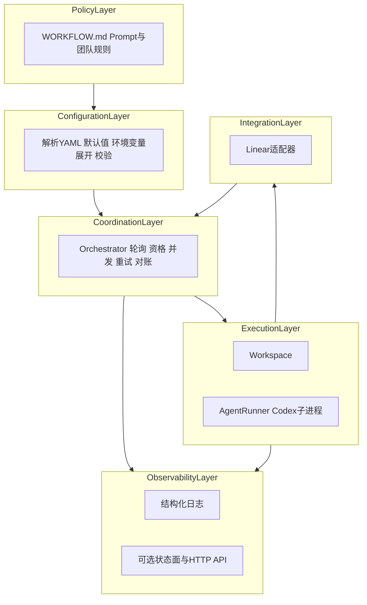
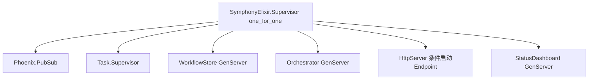
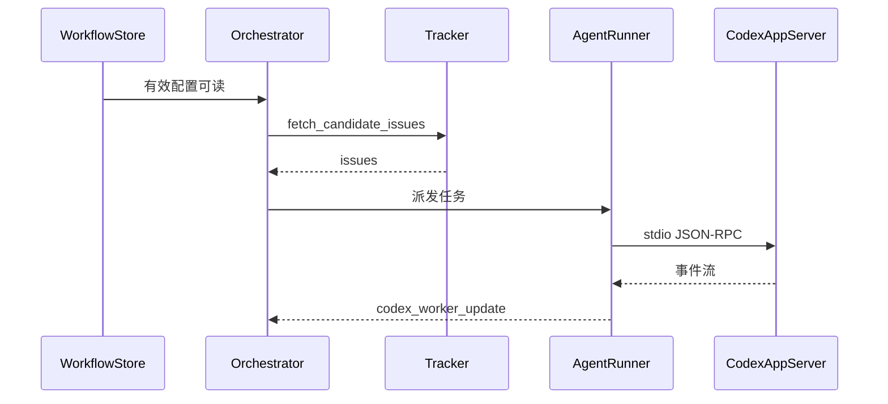

# 02 架构：分层与 OTP 落地

## 语言无关的六层抽象

[SPEC.md](../SPEC.md) 第 3.2 节将可移植实现划分为：

| 层 | 职责 | Elixir 中主要落点 |
|----|------|-------------------|
| Policy | Prompt 正文、团队流程说明 | `WORKFLOW.md` Markdown 体 |
| Configuration | 类型化配置、校验 | [SymphonyElixir.Config](../elixir/lib/symphony_elixir/config.ex)、[Config.Schema](../elixir/lib/symphony_elixir/config/schema.ex) |
| Coordination | 轮询、claim、重试、对账 | [SymphonyElixir.Orchestrator](../elixir/lib/symphony_elixir/orchestrator.ex) |
| Execution | 工作区、Hook、启动 Codex | [Workspace](../elixir/lib/symphony_elixir/workspace.ex)、[AgentRunner](../elixir/lib/symphony_elixir/agent_runner.ex)、[Codex.AppServer](../elixir/lib/symphony_elixir/codex/app_server.ex) |
| Integration | Linear GraphQL | [Linear.Client](../elixir/lib/symphony_elixir/linear/client.ex)、[Tracker](../elixir/lib/symphony_elixir/tracker.ex) |
| Observability | 日志、终端 UI、HTTP | [LogFile](../elixir/lib/symphony_elixir/log_file.ex)、[StatusDashboard](../elixir/lib/symphony_elixir/status_dashboard.ex)、[HttpServer](../elixir/lib/symphony_elixir/http_server.ex)、Phoenix 路由 |

## SPEC 中的主组件映射

SPEC 第 3.1 节列出的组件与实现对应关系：

1. **Workflow Loader** → [Workflow](../elixir/lib/symphony_elixir/workflow.ex)、[WorkflowStore](../elixir/lib/symphony_elixir/workflow_store.ex)
2. **Config Layer** → `Config` / `Config.Schema`
3. **Issue Tracker Client** → `Linear.Client`、`Tracker` 适配器
4. **Orchestrator** → `Orchestrator`
5. **Workspace Manager** → `Workspace`
6. **Agent Runner** → `AgentRunner`
7. **Status Surface**（可选）→ `StatusDashboard`、LiveView 仪表盘
8. **Logging** → Logger + `LogFile` 等

## OTP 监督树（Elixir）

应用入口在 [symphony_elixir.ex](../elixir/lib/symphony_elixir.ex) 的 `SymphonyElixir.Application`：

- **WorkflowStore**：轮询 `WORKFLOW.md` 变更，缓存「最后已知良好」配置；失败时不应拖垮整个节点（SPEC 6.2：无效重载保留上次有效配置）。
- **Orchestrator**：调度心脏；`AgentRunner.run/3` 通常在 `Task.Supervisor` 下异步执行（见 Orchestrator 实现）。
- **HttpServer**：若未配置端口或为禁用状态，子规格可返回 `:ignore`，不启动 Phoenix。
- **StatusDashboard**：终端上的运行摘要（与是否启用 HTTP 独立）。

CLI 入口 [SymphonyElixir.CLI](../elixir/lib/symphony_elixir/cli.ex) 在 `Application.ensure_all_started(:symphony_elixir)` 前设置 `workflow_file_path`、`logs_root`、`server_port_override` 等。

## 典型数据流（简化）

## 为何用 GenServer + TaskSupervisor

- **GenServer**：编排状态在同一进程串行修改，避免重复派发、竞态 claim。
- **TaskSupervisor**：每个工单运行隔离任务，崩溃可监督、符合「一线程一工单」的故障隔离直觉。

## 下一篇

- [03-core-concepts.md](03-core-concepts.md)：实体与字段级概念。
- 端到端时序：[04-end-to-end-flow.md](04-end-to-end-flow.md)。
