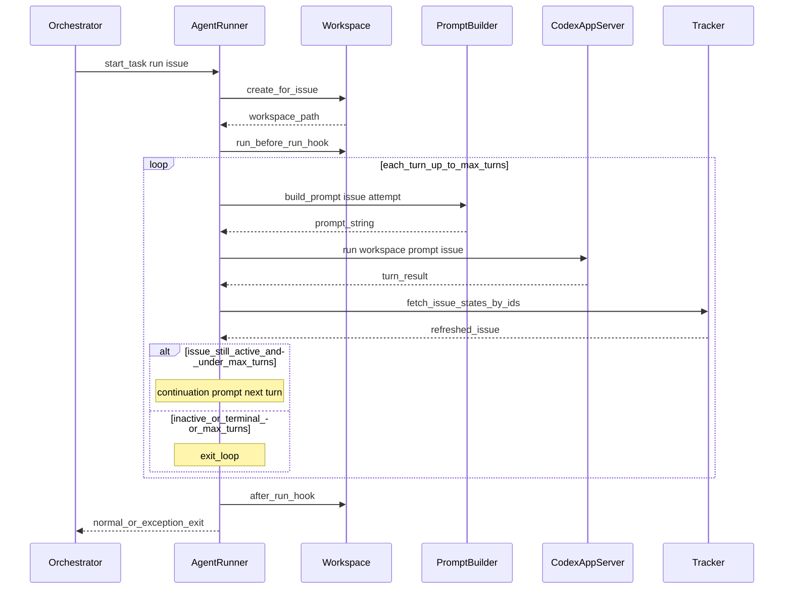

# 04 端到端流程：从轮询到一次 Agent 运行

本文把 [SPEC.md](../SPEC.md) 第 16 节伪代码与 Elixir 模块串联，便于建立「谁在何时调用谁」的心智模型。

## 参与模块（速查）

| 阶段 | 模块 |
|------|------|
| 配置 | [WorkflowStore](../elixir/lib/symphony_elixir/workflow_store.ex)、[Config](../elixir/lib/symphony_elixir/config.ex) |
| 轮询与派发 | [Orchestrator](../elixir/lib/symphony_elixir/orchestrator.ex) |
| 工单拉取 | [Tracker](../elixir/lib/symphony_elixir/tracker.ex) → [Linear.Client](../elixir/lib/symphony_elixir/linear/client.ex) |
| 执行 | [AgentRunner](../elixir/lib/symphony_elixir/agent_runner.ex) |
| 工作区 | [Workspace](../elixir/lib/symphony_elixir/workspace.ex) |
| Prompt | [PromptBuilder](../elixir/lib/symphony_elixir/prompt_builder.ex) |
| Codex | [Codex.AppServer](../elixir/lib/symphony_elixir/codex/app_server.ex) |
| 动态工具 | [Codex.DynamicTool](../elixir/lib/symphony_elixir/codex/dynamic_tool.ex) |

## 启动（简化）

对应 SPEC 16.1 `start_service` 与 `Application.start/2`：

1. 配置日志（[LogFile](../elixir/lib/symphony_elixir/log_file.ex)）。
2. 启动监督子项：`WorkflowStore` 必须成功加载 `WORKFLOW.md`，否则应用启动失败。
3. `Orchestrator.init/1`：读取 `Config.settings!/0`，执行**启动时终态工作区清理**（SPEC 8.6），调度首次 `tick`（延迟 0）。

## 单次 Poll Tick（简化）

对应 SPEC 16.2 `on_tick`：

1. **对账** `reconcile_running_issues`：stall 检测 + 拉取运行中工单的最新状态；终态则停 worker 并清理工作区；非活动非终态则停 worker 不清理（见 SPEC 8.5）。
2. **派发前校验**：若 `WORKFLOW.md` 或密钥等无效，本 tick **跳过新派发**，对账仍执行。
3. **拉候选**：`Tracker.fetch_candidate_issues/0`。
4. **排序与过滤**：优先级、`created_at`、identifier  tie-break；检查全局/按状态并发槽、claim 集合、阻塞规则。
5. **派发**：对 eligible issue 启动异步 `AgentRunner.run/3`（通常带 `max_turns` 等 opts），并写入 `running`、`claimed`。

## 单次 Worker：AgentRunner + Codex（概念时序）

下列时序省略 SSH 分支与部分错误路径，突出主路径：

**要点**：

- **第一 Turn** 使用完整任务 Prompt；**同一次 worker 会话内**后续 Turn 由 AgentRunner/Codex 侧按实现发送续写指引（对齐 SPEC 7.1 续跑语义；具体字符串构造见源码 `AgentRunner`）。
- 每 Turn 结束后会 **刷新工单状态**；若已非活动态则结束循环，避免无效消耗。

## Codex 事件如何回到 Orchestrator

`AgentRunner` 在启动会话时将回调发给 Orchestrator（或 nil）：`{:codex_worker_update, issue_id, message}` 等消息，用于更新 `running` 条目中的 `session_id`、token、`last_codex_event` 等，供仪表盘与 stall 检测使用。

## Worker 退出之后

- **正常退出**：从 `running` 移除，累计运行时间入 `codex_totals`，并调度**短延迟连续重试**（约 1s），以便工单仍在活动态时再次派发新会话（SPEC 7.1 续跑语义）。
- **异常**：指数退避重试；槽位不足时重试项带 `no available orchestrator slots` 类错误（见 Orchestrator 实现）。

## 与「PR 合入、工单 Done」的关系

Symphony **不**在编排器内硬编码「必须 merge」；仓库示例 [elixir/WORKFLOW.md](../elixir/WORKFLOW.md) 的 Markdown 体 instructs Agent 使用 `pull`/`land` 技能、Linear 状态机等。**业务完成条件**以你的 `WORKFLOW.md` 为准。

## 下一篇

- [05-workflow-md.md](05-workflow-md.md)：如何编写与热更新 `WORKFLOW.md`。
- [06-orchestrator-state.md](06-orchestrator-state.md)：状态机与重试公式。
