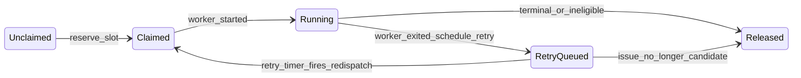
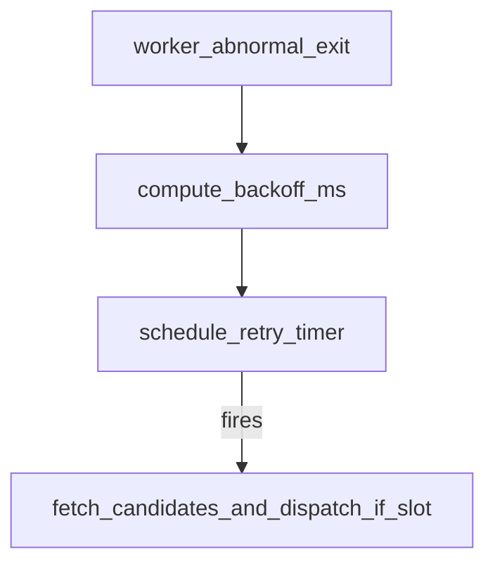

# 06 编排器：内部状态机、调度、重试与对账

核心实现：[SymphonyElixir.Orchestrator](../elixir/lib/symphony_elixir/orchestrator.ex)。规范对照 [SPEC.md](../SPEC.md) 第 7–8 节与第 16 节伪代码。

## 工单编排状态（非 Linear 状态）

SPEC 7.1 定义服务内部认领语义：

**记忆口诀**：`claimed` 防重复；`running` 真有 worker；`retry_attempts` 等钟响。

## Run Attempt 生命周期（SPEC 7.2）

从准备到结束的阶段名用于日志与测试断言对齐，例如：

`PreparingWorkspace` → `BuildingPrompt` → `LaunchingAgentProcess` → `InitializingSession` → `StreamingTurn` → `Finishing` → (`Succeeded` | `Failed` | `TimedOut` | `Stalled` | `CanceledByReconciliation`)

实现中部分阶段以日志或内部状态体现，不必在 API 中逐字段暴露。

### Run Attempt 阶段（示意）

以下为 SPEC 7.2 所列阶段的**线性推进示意**（失败/对账取消可从任一点跃迁到 `Failed` / `CanceledByReconciliation` 等，细节以代码为准）：

## Poll Tick 顺序（SPEC 8.1）

每个 tick 典型顺序：

1. **对账** `reconcile_running_issues`（先于派发）。
2. **派发前校验**；失败则跳过本 tick 派发。
3. **拉候选** `fetch_candidate_issues`。
4. **排序**：`priority` 升序 → `created_at` 旧优先 → `identifier` 字典序。
5. **派发**：直到全局/按状态槽满。

## 候选资格（SPEC 8.2 摘要）

必须同时满足：

- 有 `id`、`identifier`、`title`、`state`。
- `state` 在 `active_states` 且不在 `terminal_states`。
- 不在 `running`、不在 `claimed`（实现细节：派发前会 claim）。
- 全局与 **按状态** 并发未满。
- **Todo 阻塞规则**：若状态为 `Todo`，任一 `blocked_by` 的阻塞者状态**非终态**则不派发。

## 重试与退避（SPEC 8.4 + 实现常量）

实现文件顶部常量（与 SPEC 对齐意图）：

- **连续重试**（worker 正常退出后）：`@continuation_retry_delay_ms` = **1000** ms。  
- **失败重试**：`delay = min(10000 * 2^(attempt - 1), agent.max_retry_backoff_ms)`，其中 `attempt` 为失败重试计数语义（见源码 `schedule_failure_retry` 系列）。

**重试 tick 行为**：再次拉候选列表，按 `issue_id` 查找；找不到则释放 claim；仍候选但无槽则带错再次入队。

## 对账（SPEC 8.5）

### Part A：Stall 检测

对每个 `running` 条目，若自上次 Codex 事件（无事件则用 `started_at`）起经过时间 **>** `codex.stall_timeout_ms`，则终止 worker 并入失败重试路径。`stall_timeout_ms <= 0` 关闭。

### Part B：Tracker 状态刷新

批量 `fetch_issue_states_by_ids`：

- **终态**：停 worker，**清理工作区**（含 `before_remove` Hook 等实现细节见 Workspace）。
- **仍活动**：更新内存中的 issue 快照（例如状态展示）。
- **既非活动也非终态**：停 worker，**不清理**工作区（SPEC：非活动）。

刷新失败：**保持 worker 运行**，下 tick 再试。

## 启动时终态清理（SPEC 8.6）

启动时拉取 `terminal_states` 列表中的工单，对其 identifier 对应工作区执行删除，避免重启后磁盘垃圾堆积。拉取失败：**告警日志并继续启动**。

## 状态图：一次失败重试的退避

## 与 StatusDashboard 的交互

Orchestrator 在 tick 开始、派发、重试、对账等节点 `notify_dashboard/0`，供终端 UI 刷新（见 [12-operations-and-debug.md](12-operations-and-debug.md)）。

## 下一篇

- [04-end-to-end-flow.md](04-end-to-end-flow.md)：把 tick 与 AgentRunner 串起来。
- [07-codex-integration.md](07-codex-integration.md)：子进程与 Turn 语义。
