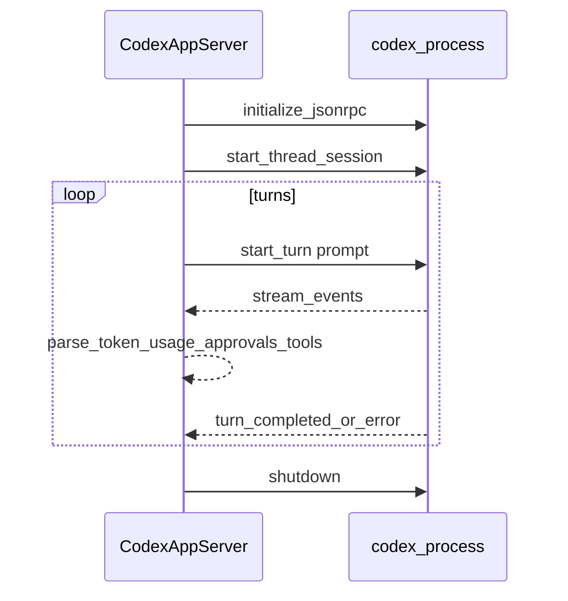

# 07 Codex 集成：App-Server、多 Turn、Token 与 linear_graphql

## 职责边界

Symphony 负责：**在工作区内**启动 Codex、维护会话与 Turn 循环、把协议事件翻译为编排器可消费的结构、可选注入客户端工具。

**协议真相源**：目标版本的 Codex App-Server 文档与 JSON Schema（SPEC 10 指向 `codex app-server generate-json-schema`）。本实现 [Codex.AppServer](../elixir/lib/symphony_elixir/codex/app_server.ex) 注释写明：**JSON-RPC 2.0 over stdio** 的最小客户端。

## 启动契约（SPEC 10.1）

- 命令：`codex.command`，默认 `codex app-server`。
- 调用形态：`bash -lc <command>`，**cwd** 为工单工作区（本地或 SSH 远端等价目录）。
- 读取/会话超时、`turn_timeout`、`stall_timeout` 与编排器侧 stall 协同见 [05-workflow-md.md](05-workflow-md.md)。

## 会话与 Turn（概念时序）

**Thread / Turn**：同一 worker 生命周期内应复用 `thread_id`；`session_id` 规范为 `<thread_id>-<turn_id>`（SPEC 4.1.6）。

**续跑**：首 Turn 使用完整任务 Prompt；后续 Turn 在工单仍活动且未达 `max_turns` 时继续；具体续写内容由 `AgentRunner` 与 `AppServer` 协作实现（避免重复把整个工单描述塞进 thread 历史——对齐 SPEC 7.1 意图）。

## 审批与用户输入（SPEC 10.5）

非交互编排下，常见策略：

- 对 `approval_policy: never` 等配置，实现可能将部分审批自动通过（见 `AppServer` 中 `auto_approve_requests` 与注释）。
- **用户输入请求**不得无限阻塞：实现以固定字符串应答或按策略失败（见 `AppServer` `@non_interactive_tool_input_answer`）。

部署前务必阅读 [elixir/README.md](../elixir/README.md) 的安全默认值与你的 `WORKFLOW.md` 显式覆盖。

## 动态工具：linear_graphql

[DynamicTool](../elixir/lib/symphony_elixir/codex/dynamic_tool.ex) 在会话启动时向 App-Server **声明工具规格**（`tool_specs/0`），执行时：

- 工具名：`linear_graphql`。
- 输入：`{"query": "...", "variables": {...}}`（`variables` 可选）。
- 使用当前 Symphony 配置的 Linear endpoint 与 API Key 代发请求，避免模型直接读盘拿 token。

不支持的动态工具名：返回**失败结果**但不使会话僵死（SPEC 10.5）。

## Token 累计（必读原文）

编排器侧展示与 `codex_totals` 依赖 App-Server 事件中的 usage 字段。**不要**把所有名为 `usage` 的 map 都当累计值。

请直接阅读并收藏仓库内英文专题：

- [elixir/docs/token_accounting.md](../elixir/docs/token_accounting.md)

摘要规则：**优先** `thread/tokenUsage/updated` 中的 **total** 绝对累计；**忽略** `last`/delta 用于 dashboard 总和；慎混用 `turn/completed` 的 usage 语义。

## 错误类别（SPEC 10.6 节选）

实现与日志中可能出现的归一化类别包括：`codex_not_found`、`invalid_workspace_cwd`、`response_timeout`、`turn_timeout`、`port_exit` 等。排障时结合 `issue_id`、`issue_identifier`、`session_id` 三路检索（见 [logging.md](../elixir/docs/logging.md)）。

## SSH 上跑 Codex

当 `worker.ssh_hosts` 非空时，`AppServer` 通过 [SSH](../elixir/lib/symphony_elixir/ssh.ex) 在远端启动 `Port`，stdio 仍回到本进程解析。`workspace.root` 在 SPEC 附录 A 中解释为**远端路径**。

## 下一篇

- [08-linear-tracker.md](08-linear-tracker.md)：Linear API 侧。
- [12-operations-and-debug.md](12-operations-and-debug.md)：如何根据日志查一次卡住的 Turn。
